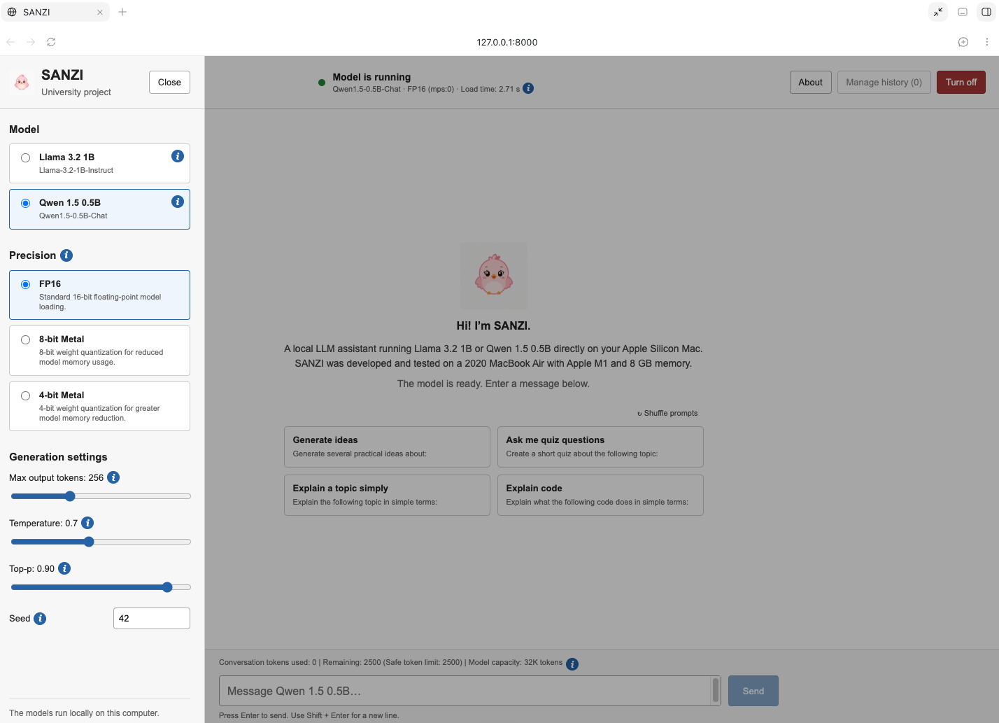

# SANZI

SANZI is a local chatbot for running small language models on Apple Silicon. It includes a browser GUI and a separate terminal CLI, and runs model inference locally.

## Preview




Supported models:

- `Llama-3.2-1B-Instruct`
- `Qwen1.5-0.5B-Chat`

The browser GUI and CLI support FP16, 8-bit Metal, and 4-bit Metal inference.

## Requirements

- macOS on Apple Silicon for MPS/Metal acceleration
- Python 3.11
- Node.js 18 or newer and pnpm for frontend development
- Sufficient free memory for the selected model and precision

Metal quantization requires Apple Silicon, an available PyTorch MPS backend, and the pinned `kernels` package.

FP16 can also run on another PyTorch-supported device, but SANZI was developed and tested on Apple Silicon.

## Project structure

```text
PROJECT-SANZI/
├── CODES/
│   ├── CLI/                  # Interactive CLI and CLI tests
│   ├── backend/              # HTTP API and backend tests
│   ├── frontend/             # Vue source and compiled production GUI
│   ├── benchmark_runs/       # Repeated final benchmark script and outputs
│   ├── benchmark_models.py   # Run the six model/precision benchmarks
│   ├── benchmark_results.csv # Saved one-shot benchmark measurements
│   ├── download_llama.py     # Download Llama model
│   └── download_qwen.py      # Download Qwen model
├── PRESENTATION/
├── REPORT/
├── README.md
└── .gitignore
```

## Python setup

Run application commands from the `CODES/` folder unless a section says otherwise.

```bash
cd CODES
```

```bash
python3.11 -m venv venv
source venv/bin/activate
python -m pip install --upgrade pip
python -m pip install -r backend/requirements.txt
```

Create a fresh virtual environment when setting up SANZI. Do not rely on or copy
a submitted `venv/` folder because virtual environments contain machine-specific
paths and are not portable between computers.

The dependency versions in `backend/requirements.txt` are the tested versions.

Keep `tqdm==4.67.3` because this exact version was verified to work with the Metal quantization kernel loader.

## Model downloads

SANZI loads model weights from the local `models/` folder with `local_files_only=True`.

If the model folders already contain the required files, downloading them again is not necessary.

Download Qwen:

```bash
python download_qwen.py
```

Llama is a gated Hugging Face model. Accept its license on Hugging Face and authenticate before downloading:

```bash
python -c "from huggingface_hub import login; login()"
python download_llama.py
```

The download scripts use the verified model revisions:

- Llama: `9213176726f574b556790deb65791e0c5aa438b6`
- Qwen: `4d14e384a4b037942bb3f3016665157c8bcb70ea`

## Production GUI

The compiled Vue application in `frontend/dist/` is served by the Python backend, so normal use requires only one backend process.

```bash
source venv/bin/activate
python backend/app.py
```

Open:

<http://127.0.0.1:8000>

Select a model and precision, then click **Turn on**. SANZI keeps only one model loaded at a time.
When a model is running and the conversation is empty, the welcome screen also
shows starter prompt cards with a shuffle control.

## Mock GUI

Mock mode allows the GUI and HTTP API to be tested without loading real model weights.

```bash
source venv/bin/activate
python backend/app.py --mock
```

Open:

<http://127.0.0.1:8000>

## Frontend development

Start the mock backend from the `CODES/` folder:

```bash
source venv/bin/activate
python backend/app.py --mock
```

In a second terminal, start the Vite development server:

```bash
cd frontend
pnpm install --frozen-lockfile
pnpm dev
```

Open:

<http://127.0.0.1:5173>

Vite forwards `/api` requests to the Python backend at `127.0.0.1:8000`.

After changing frontend source files, rebuild the production GUI with:

```bash
cd frontend
pnpm build
```

## CLI

Start the interactive CLI from the `CODES/` folder:

```bash
source venv/bin/activate
python CLI/chat_terminal.py
```

Available commands:

- `/clear` clears the complete conversation.
- `/history` displays the saved conversation rounds.
- `/remove n` removes the first `n` conversation rounds.
- `/model 1` switches to Llama.
- `/model 2` switches to Qwen.
- `exit` or `quit` stops the CLI.

The CLI preserves conversation history when switching models.

`CLI/test_models.py` is a manual FP16 smoke test for both local models:

```bash
python CLI/test_models.py
```

## Precision modes

SANZI supports the following precision configurations:

- **FP16** — standard half-precision model loading.
- **8-bit Metal** — uses `MetalConfig(bits=8, group_size=64)` in the GUI and CLI.
- **4-bit Metal** — uses `MetalConfig(bits=4, group_size=64)` in the GUI and CLI.

FP16 uses MPS when available. The Metal quantized modes require Apple Silicon and an available MPS backend.

## Metal quantization kernel

The first 8-bit or 4-bit generation on a fresh environment may download a compatible Metal quantization kernel from Hugging Face.

Verified kernel:

- Repository: `kernels-community/mlx-quantization-metal-kernels`
- Snapshot: `17a3679b9ba06755e957d31781f8e502bd8767d6`

An internet connection may therefore be required for the first quantized run on a fresh machine.

The third-party Metal kernel is not included directly in this project. Model weights themselves are loaded from the local `models/` directory.

## Benchmark

Run the six one-shot model and precision benchmarks from the `CODES/` folder:

```bash
source venv/bin/activate
python benchmark_models.py
```

The benchmark prints a results table and saves the measurements to `benchmark_results.csv`.

The `benchmark_runs/` folder contains the repeated final benchmark evidence used
for the project presentation. `repeat_sanzi_benchmark.py` repeats each
model/precision configuration five times, and
`sanzi_repeated_benchmark_20260828_232654/` stores the final CSV/JSON outputs.

## Tests

Run the backend unit tests from the `CODES/` folder:

```bash
source venv/bin/activate
python -m unittest backend.test_app -v
```

The current backend test suite contains 46 tests covering model state, precision switching, conversation handling, token limits, continuation behavior, and other backend functionality.

## Runtime safeguards

SANZI includes several safeguards for running local models on limited hardware:

- Model files are loaded from local paths only.
- Only one model is kept loaded at a time.
- A 2,500-token safe input/context budget limits memory pressure.
- Each generation call has a 120-second safety limit.
- Model loading and inference requests are serialized.
- Out-of-memory errors are detected and handled.
- CPU and MPS caches are cleared when models are unloaded or memory errors occur.
- Conversation rounds can be removed or cleared without restarting the application.
- Token usage is displayed for user input and generated output.
- Responses stopped by an output, time, or completeness limit can be continued in the same conversation round.

## Development and test environment

SANZI was developed and tested on a 2020 MacBook Air with:

- Apple M1
- 8 GB unified memory
- Python 3.11
- PyTorch with MPS acceleration
- Hugging Face Transformers

Both supported models were successfully tested with FP16, 8-bit Metal, and 4-bit Metal in the browser GUI and CLI.

## License: 
All rights reserved. This repository is shared for academic and portfolio purposes. Reuse, redistribution, or modification is not permitted without permission.
